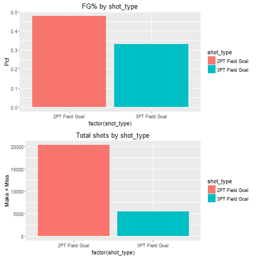

Start by loading necessary packages and data


Shot chart plots.


Split the shot chart by shot type and period.


Test the accuracy of some of the shot zone data elements.


```r
####################################################################################################
## Shot type data and plots
####################################################################################################
## action_type table (these are very specific)
action.type.tbl <- as.data.frame(data.all %>% 
                                   filter(!is.na(shot_made_flag)) %>% 
                                   select(action_type,combined_shot_type,shot_made_flag) %>% 
                                   table)
action.type.tbl <- dcast(action.type.tbl, action_type + combined_shot_type ~ shot_made_flag,value.var='Freq')
colnames(action.type.tbl)[3:4] <- c('Miss','Make')
action.type.tbl <- action.type.tbl %>%
        mutate(Pct = Make / (Make + Miss)) %>% arrange(desc(Pct)) %>%
        filter(!is.na(Pct))
action.type.tbl$action_type <- factor(action.type.tbl$action_type,
                                      levels=action.type.tbl[order(action.type.tbl$combined_shot_type),
                                                             'action_type'])
print(action.type.tbl)
```

```
##                        action_type combined_shot_type  Miss Make       Pct
## 1  Driving Floating Bank Jump Shot          Jump Shot     0    1 1.0000000
## 2                   Hook Bank Shot          Bank Shot     0    5 1.0000000
## 3           Reverse Slam Dunk Shot               Dunk     0   15 1.0000000
## 4           Running Slam Dunk Shot               Dunk     0    1 1.0000000
## 5      Turnaround Finger Roll Shot              Layup     0    2 1.0000000
## 6                   Slam Dunk Shot               Dunk     6  328 0.9820359
## 7           Driving Slam Dunk Shot               Dunk     1   42 0.9767442
## 8                Driving Dunk Shot               Dunk     6  251 0.9766537
## 9              Alley Oop Dunk Shot               Dunk     5   90 0.9473684
## 10               Reverse Dunk Shot               Dunk     5   56 0.9180328
## 11             Follow Up Dunk Shot               Dunk     1    9 0.9000000
## 12              Fadeaway Bank shot          Jump Shot     3   24 0.8888889
## 13               Running Dunk Shot               Dunk     2   16 0.8888889
## 14  Driving Finger Roll Layup Shot              Layup     7   52 0.8813559
## 15               Running Hook Shot          Hook Shot     4   29 0.8787879
## 16        Driving Finger Roll Shot              Layup    10   58 0.8529412
## 17               Running Bank shot          Bank Shot     7   36 0.8372093
## 18          Finger Roll Layup Shot              Layup     5   23 0.8214286
## 19            Turnaround Bank shot          Bank Shot    12   46 0.7931034
## 20                       Dunk Shot               Dunk    48  169 0.7788018
## 21                  Jump Bank Shot          Jump Shot    65  224 0.7750865
## 22               Running Jump Shot          Jump Shot   197  582 0.7471117
## 23      Driving Reverse Layup Shot              Layup    21   62 0.7469880
## 24              Driving Layup Shot              Layup   421 1207 0.7414005
## 25                  Jump Hook Shot          Jump Shot     5   14 0.7368421
## 26                Pullup Jump shot          Jump Shot   111  291 0.7238806
## 27              Floating Jump shot          Jump Shot    26   67 0.7204301
## 28            Alley Oop Layup shot              Layup    19   48 0.7164179
## 29              Running Layup Shot              Layup    15   36 0.7058824
## 30              Cutting Layup Shot              Layup     2    4 0.6666667
## 31               Driving Bank shot          Bank Shot     1    2 0.6666667
## 32               Putback Dunk Shot               Dunk     1    2 0.6666667
## 33              Putback Layup Shot              Layup     3    6 0.6666667
## 34       Running Pull-Up Jump Shot          Jump Shot     1    2 0.6666667
## 35              Reverse Layup Shot              Layup   121  212 0.6366366
## 36             Step Back Jump shot          Jump Shot    39   67 0.6320755
## 37               Driving Hook Shot          Hook Shot     5    8 0.6153846
## 38  Running Finger Roll Layup Shot              Layup     2    3 0.6000000
## 39            Turnaround Jump Shot          Jump Shot   358  533 0.5982043
## 40        Turnaround Fadeaway shot          Jump Shot   152  214 0.5846995
## 41              Fadeaway Jump Shot          Jump Shot   371  501 0.5745413
## 42      Running Reverse Layup Shot              Layup     3    4 0.5714286
## 43                Pullup Bank shot          Bank Shot     5    6 0.5454545
## 44          Putback Slam Dunk Shot               Dunk     1    1 0.5000000
## 45                  Tip Layup Shot              Layup     1    1 0.5000000
## 46            Turnaround Hook Shot          Hook Shot     4    4 0.5000000
## 47                Finger Roll Shot              Layup    14   12 0.4615385
## 48               Driving Jump shot          Jump Shot    13   10 0.4347826
## 49                      Layup Shot              Layup  1324  830 0.3853296
## 50                       Hook Shot          Hook Shot    46   27 0.3698630
## 51                        Tip Shot           Tip Shot    98   53 0.3509934
## 52      Driving Floating Jump Shot          Jump Shot     2    1 0.3333333
## 53                       Jump Shot          Jump Shot 10659 5177 0.3269134
## 54        Running Finger Roll Shot              Layup     3    1 0.2500000
## 55                Running Tip Shot           Tip Shot     1    0 0.0000000
```

```r
## pretty decent at those dunks
ggplot(action.type.tbl,aes(x=action_type,y=Pct,fill=combined_shot_type)) + 
        geom_bar(stat='identity') +
        ggtitle('FG% by action_type')
```


```r
## looks like there is some information to be gained by this specificity


## combined_shot_type table
cbind.type.tbl <- as.data.frame(data.all %>%
                                    filter(!is.na(shot_made_flag)) %>%
                                    select(combined_shot_type,shot_made_flag) %>%
                                    table)
cbind.type.tbl <- dcast(cbind.type.tbl, combined_shot_type ~ shot_made_flag,value.var='Freq')
colnames(cbind.type.tbl)[2:3] <- c('Miss','Make')
cbind.type.tbl <- cbind.type.tbl %>% mutate(Pct = Make / (Make + Miss)) %>% arrange(desc(Pct))
print(cbind.type.tbl)
```

```
##   combined_shot_type  Miss Make       Pct
## 1               Dunk    76  980 0.9280303
## 2          Bank Shot    25   95 0.7916667
## 3              Layup  1971 2561 0.5650927
## 4          Hook Shot    59   68 0.5354331
## 5          Jump Shot 12002 7708 0.3910705
## 6           Tip Shot    99   53 0.3486842
```

```r
multiplot(
ggplot(cbind.type.tbl,aes(x=factor(combined_shot_type),y=Pct,fill=combined_shot_type)) +
    geom_bar(stat='identity') + 
    ggtitle('FG% by combined_shot_type'),
ggplot(cbind.type.tbl,aes(x=factor(combined_shot_type),y=Make+Miss,fill=combined_shot_type)) + 
    geom_bar(stat='identity') +
    ggtitle('Total shots by combined_shot_type')
)
```


```r
## shot_type
shot_type.tbl <- as.data.frame(data.all %>%
                                filter(!is.na(shot_made_flag)) %>%
                                select(shot_type,shot_made_flag) %>%
                                table)
shot_type.tbl <- dcast(shot_type.tbl, shot_type ~ shot_made_flag,value.var='Freq')
colnames(shot_type.tbl)[2:3] <- c('Miss','Make')
shot_type.tbl <- shot_type.tbl %>% mutate(Pct = Make / (Make + Miss)) %>% arrange(desc(Pct))
print(shot_type.tbl)
```

```
##        shot_type  Miss Make       Pct
## 1 2PT Field Goal 10602 9683 0.4773478
## 2 3PT Field Goal  3630 1782 0.3292683
```

```r
multiplot(
    ggplot(shot_type.tbl,aes(x=factor(shot_type),y=Pct,fill=shot_type)) +
        geom_bar(stat='identity') + 
        ggtitle('FG% by shot_type'),
    ggplot(shot_type.tbl,aes(x=factor(shot_type),y=Make+Miss,fill=shot_type)) + 
        geom_bar(stat='identity') +
        ggtitle('Total shots by shot_type')
)
```



```r
## QUIT SHOOTIN' 3's KOBE!!


####################################################################################################
## Shot zone data and plots
####################################################################################################
## shot_zone_range
shot.dist.tbl <- as.data.frame(data.all %>% 
                                   filter(!is.na(shot_made_flag)) %>% 
                                   select(shot_zone_range,shot_made_flag) %>% 
                                   table)
shot.dist.tbl <- dcast(shot.dist.tbl,shot_zone_range ~ shot_made_flag,value.var='Freq')
colnames(shot.dist.tbl)[2:3] <- c('Miss','Make')
shot.dist.tbl <- shot.dist.tbl %>% mutate(Pct = Make / (Make + Miss)) %>% arrange(desc(Pct))
shot.dist.tbl$shot_zone_range <- factor(shot.dist.tbl$shot_zone_range,
                                      levels=shot.dist.tbl[order(shot.dist.tbl$Pct,decreasing=TRUE),
                                                           'shot_zone_range'])
print(shot.dist.tbl)
```

```
##   shot_zone_range Miss Make        Pct
## 1 Less Than 8 ft. 3354 4503 0.57311951
## 2        8-16 ft. 3150 2430 0.43548387
## 3       16-24 ft. 4132 2775 0.40176632
## 4         24+ ft. 3525 1756 0.33251278
## 5 Back Court Shot   71    1 0.01388889
```

```r
multiplot(
    ggplot(shot.dist.tbl,aes(x=factor(shot_zone_range),y=Pct,fill=shot_zone_range)) + 
        geom_bar(stat='identity') + 
        ggtitle('FG% by shot distance'),
    ggplot(shot.dist.tbl,aes(x=factor(shot_zone_range),y=Make+Miss,fill=shot_zone_range)) + 
        geom_bar(stat='identity') +
        ggtitle('Total shots by shot distance')
)
```


```r
## Might be better to split 0 ft. out on its own
shot.dist.tbl.new <- data.all %>% 
    mutate(shot_zone_range_new = ifelse(shot_distance == 0,0,shot_zone_range))
shot.dist.tbl.new$shot_zone_range_new <- factor(shot.dist.tbl.new$shot_zone_range_new,
                                                labels=c('0 ft.',levels(shot.dist.tbl.new$shot_zone_range)))
shot.dist.tbl.new <- as.data.frame(shot.dist.tbl.new %>% 
                                      filter(!is.na(shot_made_flag)) %>% 
                                      select(shot_zone_range_new,shot_made_flag) %>% 
                                      table)
shot.dist.tbl.new <- dcast(shot.dist.tbl.new,shot_zone_range_new ~ shot_made_flag,value.var='Freq')
colnames(shot.dist.tbl.new)[2:3] <- c('Miss','Make')
shot.dist.tbl.new <- shot.dist.tbl.new %>% mutate(Pct = Make / (Make + Miss)) %>% arrange(desc(Pct))
shot.dist.tbl.new$shot_zone_range_new <- factor(shot.dist.tbl.new$shot_zone_range_new,
                                                levels=shot.dist.tbl.new[order(shot.dist.tbl.new$Pct,
                                                                               decreasing=TRUE),
                                                                         'shot_zone_range_new'])
print(shot.dist.tbl.new)
```

```
##   shot_zone_range_new Miss Make        Pct
## 1               0 ft. 1683 2925 0.63476562
## 2     Less Than 8 ft. 1671 1578 0.48568790
## 3            8-16 ft. 3150 2430 0.43548387
## 4           16-24 ft. 4132 2775 0.40176632
## 5             24+ ft. 3525 1756 0.33251278
## 6     Back Court Shot   71    1 0.01388889
```

```r
multiplot(
    ggplot(shot.dist.tbl.new,aes(x=factor(shot_zone_range_new),y=Pct,fill=shot_zone_range_new)) + 
        geom_bar(stat='identity') + 
        ggtitle('FG% by shot distance'),
    ggplot(shot.dist.tbl.new,aes(x=factor(shot_zone_range_new),y=Make+Miss,fill=shot_zone_range_new)) + 
        geom_bar(stat='identity') +
        ggtitle('Total shots by shot distance')
)
```


```r
## let's compare to shot_zone_area and shot_zone_basic
shot.zone.area.tbl <- as.data.frame(data.all %>% 
                                   filter(!is.na(shot_made_flag)) %>% 
                                   select(shot_zone_area,shot_made_flag) %>% 
                                   table)
shot.zone.area.tbl <- dcast(shot.zone.area.tbl,shot_zone_area ~ shot_made_flag,value.var='Freq')
colnames(shot.zone.area.tbl)[2:3] <- c('Miss','Make')
shot.zone.area.tbl <- shot.zone.area.tbl %>% mutate(Pct = Make / (Make + Miss)) %>% arrange(desc(Pct))
shot.zone.area.tbl$shot_zone_area <- factor(shot.zone.area.tbl$shot_zone_area,
                                        levels=shot.zone.area.tbl[order(shot.zone.area.tbl$Pct,decreasing=TRUE),
                                                             'shot_zone_area'])
print(shot.zone.area.tbl)
```

```
##          shot_zone_area Miss Make        Pct
## 1             Center(C) 5356 5933 0.52555585
## 2         Right Side(R) 2309 1550 0.40165846
## 3          Left Side(L) 1889 1243 0.39687101
## 4 Right Side Center(RC) 2458 1523 0.38256719
## 5  Left Side Center(LC) 2149 1215 0.36117717
## 6        Back Court(BC)   71    1 0.01388889
```

```r
multiplot(
    ggplot(shot.zone.area.tbl,aes(x=factor(shot_zone_area),y=Pct,fill=shot_zone_area)) + 
        geom_bar(stat='identity') + 
        ggtitle('FG% by shot_zone_area'),
    ggplot(shot.zone.area.tbl,aes(x=factor(shot_zone_area),y=Make+Miss,fill=shot_zone_area)) + 
        geom_bar(stat='identity') +
        ggtitle('Total shots by shot_zone_area')
)
```


```r
shot.zone.basic.tbl <- as.data.frame(data.all %>% 
                                        filter(!is.na(shot_made_flag)) %>% 
                                        select(shot_zone_basic,shot_made_flag) %>% 
                                        table)
shot.zone.basic.tbl <- dcast(shot.zone.basic.tbl,shot_zone_basic ~ shot_made_flag,value.var='Freq')
colnames(shot.zone.basic.tbl)[2:3] <- c('Miss','Make')
shot.zone.basic.tbl <- shot.zone.basic.tbl %>% mutate(Pct = Make / (Make + Miss)) %>% arrange(desc(Pct))
shot.zone.basic.tbl$shot_zone_basic <- factor(shot.zone.basic.tbl$shot_zone_basic,
                                            levels=shot.zone.basic.tbl[order(shot.zone.basic.tbl$Pct,decreasing=TRUE),
                                                                      'shot_zone_basic'])
print(shot.zone.basic.tbl)
```

```
##         shot_zone_basic Miss Make        Pct
## 1       Restricted Area 2266 3666 0.61800405
## 2 In The Paint (Non-RA) 2117 1763 0.45438144
## 3             Mid-Range 6253 4279 0.40628561
## 4         Left Corner 3  151   89 0.37083333
## 5        Right Corner 3  220  113 0.33933934
## 6     Above the Break 3 3166 1554 0.32923729
## 7             Backcourt   59    1 0.01666667
```

```r
multiplot(
    ggplot(shot.zone.basic.tbl,aes(x=factor(shot_zone_basic),y=Pct,fill=shot_zone_basic)) + 
        geom_bar(stat='identity') + 
        ggtitle('FG% by shot_zone_basic'),
    ggplot(shot.zone.basic.tbl,aes(x=factor(shot_zone_basic),y=Make+Miss,fill=shot_zone_basic)) + 
        geom_bar(stat='identity') +
        ggtitle('Total shots by shot_zone_basic')
)
```


```r
## probably good to keep both with interactions


####################################################################################################
## Period, season and playoffs data and plots
####################################################################################################
## period
period.tbl <- as.data.frame(data.all %>%
                                filter(!is.na(shot_made_flag)) %>%
                                select(period,shot_made_flag) %>%
                                table)
period.tbl <- dcast(period.tbl, period ~ shot_made_flag,value.var='Freq')
colnames(period.tbl)[2:3] <- c('Miss','Make')
period.tbl <- period.tbl %>% mutate(Pct = Make / (Make + Miss)) %>% arrange(desc(Pct))
print(period.tbl)
```

```
##   period Miss Make       Pct
## 1      6   16   14 0.4666667
## 2      1 3580 3120 0.4656716
## 3      3 3827 3175 0.4534419
## 4      2 3106 2529 0.4488021
## 5      5  156  124 0.4428571
## 6      7    4    3 0.4285714
## 7      4 3543 2500 0.4137018
```

```r
multiplot(
    ggplot(period.tbl,aes(x=factor(period),y=Pct,fill=period)) +
        geom_bar(stat='identity') + 
        ggtitle('FG% by period'),
    ggplot(period.tbl,aes(x=factor(period),y=Make+Miss,fill=period)) + 
        geom_bar(stat='identity') +
        ggtitle('Total shots by period')
)
```


```r
## should we group 5,6,7 into just OT? Seems like there is enough subtle separation to leave it


## season
season.tbl <- as.data.frame(data.all %>%
                                filter(!is.na(shot_made_flag)) %>%
                                select(season,shot_made_flag) %>%
                                table)
season.tbl <- dcast(season.tbl, season ~ shot_made_flag,value.var='Freq')
colnames(season.tbl)[2:3] <- c('Miss','Make')
season.tbl <- season.tbl %>% mutate(Pct = Make / (Make + Miss)) %>% arrange(desc(Pct))
print(season.tbl)
```

```
##     season Miss Make       Pct
## 1  2007-08  967  852 0.4683892
## 2  2008-09  985  866 0.4678552
## 3  2000-01  840  735 0.4666667
## 4  1999-00  708  604 0.4603659
## 5  1998-99  414  351 0.4588235
## 6  2001-02  925  783 0.4584309
## 7  2006-07  856  723 0.4578847
## 8  2012-13  720  608 0.4578313
## 9  2005-06 1051  873 0.4537422
## 10 2009-10  968  804 0.4537246
## 11 2010-11  842  679 0.4464168
## 12 2004-05  635  492 0.4365572
## 13 2002-03 1044  808 0.4362851
## 14 2003-04  777  594 0.4332604
## 15 1997-98  461  349 0.4308642
## 16 2011-12  813  603 0.4258475
## 17 1996-97  221  162 0.4229765
## 18 2013-14   35   24 0.4067797
## 19 2014-15  370  223 0.3760540
## 20 2015-16  600  332 0.3562232
```

```r
multiplot(
    ggplot(season.tbl,aes(x=factor(season),y=Pct,fill=season)) +
        geom_bar(stat='identity') + 
        ggtitle('FG% by season'),
    ggplot(season.tbl,aes(x=factor(season),y=Make+Miss,fill=season)) + 
        geom_bar(stat='identity') +
        ggtitle('Total shots by season')
)
```


```r
## playoffs
playoffs.tbl <- as.data.frame(data.all %>%
                                filter(!is.na(shot_made_flag)) %>%
                                select(playoffs,shot_made_flag) %>%
                                table)
playoffs.tbl <- dcast(playoffs.tbl, playoffs ~ shot_made_flag,value.var='Freq')
colnames(playoffs.tbl)[2:3] <- c('Miss','Make')
playoffs.tbl <- playoffs.tbl %>% mutate(Pct = Make / (Make + Miss)) %>% arrange(desc(Pct))
print(playoffs.tbl)
```

```
##   playoffs  Miss Make       Pct
## 1        0 12145 9794 0.4464196
## 2        1  2087 1671 0.4446514
```

```r
multiplot(
    ggplot(playoffs.tbl,aes(x=factor(playoffs),y=Pct,fill=playoffs)) +
        geom_bar(stat='identity') + 
        ggtitle('FG% by playoffs'),
    ggplot(playoffs.tbl,aes(x=factor(playoffs),y=Make+Miss,fill=playoffs)) + 
        geom_bar(stat='identity') +
        ggtitle('Total shots by playoffs')
)
```


```r
## pretty consistent actually.. 


## playoffs and period... gets better in the fourth/OT?
playoffs.per.tbl <- as.data.frame(data.all %>%
                                  filter(!is.na(shot_made_flag)) %>%
                                  select(playoffs,period,shot_made_flag) %>%
                                  table)
playoffs.per.tbl <- dcast(playoffs.per.tbl, playoffs + period ~ shot_made_flag,value.var='Freq')
colnames(playoffs.per.tbl)[3:4] <- c('Miss','Make')
playoffs.per.tbl <- playoffs.per.tbl %>% mutate(Pct = Make / (Make + Miss)) %>% arrange(desc(Pct))
print(playoffs.per.tbl)
```

```
##    playoffs period Miss Make       Pct
## 1         1      1  508  455 0.4724818
## 2         1      3  517  457 0.4691992
## 3         0      6   16   14 0.4666667
## 4         0      1 3072 2665 0.4645285
## 5         1      5   22   19 0.4634146
## 6         0      3 3310 2718 0.4508958
## 7         0      2 2636 2151 0.4493420
## 8         1      2  470  378 0.4457547
## 9         0      5  134  105 0.4393305
## 10        0      7    4    3 0.4285714
## 11        0      4 2973 2138 0.4183134
## 12        1      4  570  362 0.3884120
## 13        1      6    0    0       NaN
## 14        1      7    0    0       NaN
```

```r
multiplot(
    ggplot(playoffs.per.tbl,aes(x=factor(playoffs),y=Pct,fill=playoffs)) +
        geom_bar(stat='identity') + 
        facet_grid(. ~ period) +
        ggtitle('FG% by playoffs'),
    ggplot(playoffs.per.tbl,aes(x=factor(playoffs),y=Make+Miss,fill=playoffs)) + 
        geom_bar(stat='identity') +
        facet_grid(. ~ period) +
        ggtitle('Total shots by playoffs')
)
```

```
## Warning: Removed 2 rows containing missing values (position_stack).
```


```r
## Actually, pretty bad in the 4th quarter..


####################################################################################################
## Time Remaining
####################################################################################################
## minutes_remaining
minutes_remaining.tbl <- as.data.frame(data.all %>%
                                  filter(!is.na(shot_made_flag)) %>%
                                  select(minutes_remaining,shot_made_flag) %>%
                                  table)
minutes_remaining.tbl <- dcast(minutes_remaining.tbl, minutes_remaining ~ shot_made_flag,value.var='Freq')
colnames(minutes_remaining.tbl)[2:3] <- c('Miss','Make')
minutes_remaining.tbl <- minutes_remaining.tbl %>% mutate(Pct = Make / (Make + Miss)) %>% arrange(desc(Pct))
print(minutes_remaining.tbl)
```

```
##    minutes_remaining Miss Make       Pct
## 1                  7  972  904 0.4818763
## 2                  9  976  900 0.4797441
## 3                  6 1050  931 0.4699647
## 4                  5 1169 1020 0.4659662
## 5                 10  980  818 0.4549499
## 6                  4 1319 1089 0.4522425
## 7                  3 1304 1073 0.4514093
## 8                  2 1315 1064 0.4472467
## 9                  1 1257 1017 0.4472296
## 10                 8  989  760 0.4345340
## 11                11  889  653 0.4234760
## 12                 0 2012 1236 0.3805419
```

```r
multiplot(
    ggplot(minutes_remaining.tbl,aes(x=factor(minutes_remaining),y=Pct,fill=minutes_remaining)) +
        geom_bar(stat='identity') + 
        ggtitle('FG% by minutes_remaining'),
    ggplot(minutes_remaining.tbl,aes(x=factor(minutes_remaining),y=Make+Miss,fill=minutes_remaining)) + 
        geom_bar(stat='identity') +
        ggtitle('Total shots by minutes_remaining')
)
```


```r
## under a minute by group of seconds
clutch <- data.all %>% 
    filter(minutes_remaining == 0 & !is.na(shot_made_flag)) %>%
    mutate(secsBucket = ifelse(seconds_remaining > 50,'51-60',
                        ifelse(seconds_remaining > 40,'41-50',
                        ifelse(seconds_remaining > 30,'31-40',
                        ifelse(seconds_remaining > 20,'21-30',
                        ifelse(seconds_remaining > 10,'11-20','10 or less'))))))
clutch <- as.data.frame(clutch %>%
                            select(secsBucket,shot_made_flag) %>%
                            table)
clutch <- dcast(clutch, secsBucket ~ shot_made_flag,value.var='Freq')
colnames(clutch)[2:3] <- c('Miss','Make')
clutch <- clutch %>% mutate(Pct = Make / (Make + Miss)) %>% arrange(desc(Pct))
print(clutch)
```

```
##   secsBucket Miss Make       Pct
## 1      41-50  217  203 0.4833333
## 2      51-60  198  153 0.4358974
## 3      31-40  330  248 0.4290657
## 4      11-20  166  114 0.4071429
## 5      21-30  283  184 0.3940043
## 6 10 or less  818  334 0.2899306
```

```r
multiplot(
    ggplot(clutch,aes(x=secsBucket,y=Pct,fill=secsBucket)) +
        geom_bar(stat='identity') +
        ggtitle('FG% by seconds left'),
    ggplot(clutch,aes(x=secsBucket,y=Make+Miss,fill=secsBucket)) +
        geom_bar(stat='identity') +
        ggtitle('Total shots by seconds left')
)
```


```r
## probably best to come up with some time remaining feature that buckets by minute until the final
## minute of the quarter (minutes_remaining == 0)

## let's do some clustering of minutes remaining
d <- dist(data.all[!is.na(data.all$shot_made_flag),c('minutes_remaining','shot_made_flag')])
minClust <- hclust(d,'ward.D2')
plot(minClust)
```


```r
## need to try some cuts
grps1 <- cutree(minClust,k=2)
grps1 <- as.data.frame(cbind(data.all[!is.na(data.all$shot_made_flag),'minutes_remaining'],grps1))
colnames(grps1) <- c('minutes_remaining','groups')
table(grps1$minutes_remaining,grps1$groups)
```

```
##     
##         1    2
##   0     0 3248
##   1     0 2274
##   2     0 2379
##   3     0 2377
##   4     0 2408
##   5     0 2189
##   6   931 1050
##   7  1876    0
##   8  1749    0
##   9  1876    0
##   10 1798    0
##   11 1542    0
```

```r
grps2 <- cutree(minClust,k=3)
grps2 <- as.data.frame(cbind(data.all[!is.na(data.all$shot_made_flag),'minutes_remaining'],grps2))
colnames(grps2) <- c('minutes_remaining','groups')
table(grps2$minutes_remaining,grps2$groups)
```

```
##     
##         1    2    3
##   0     0    0 3248
##   1     0    0 2274
##   2     0    0 2379
##   3     0    0 2377
##   4     0 2408    0
##   5     0 2189    0
##   6   931 1050    0
##   7  1876    0    0
##   8  1749    0    0
##   9  1876    0    0
##   10 1798    0    0
##   11 1542    0    0
```

```r
grps3 <- cutree(minClust,k=4)
grps3 <- as.data.frame(cbind(data.all[!is.na(data.all$shot_made_flag),'minutes_remaining'],grps3))
colnames(grps3) <- c('minutes_remaining','groups')
table(grps3$minutes_remaining,grps3$groups)
```

```
##     
##         1    2    3    4
##   0     0    0    0 3248
##   1     0    0    0 2274
##   2     0    0    0 2379
##   3     0    0    0 2377
##   4     0    0 2408    0
##   5     0    0 2189    0
##   6     0  931 1050    0
##   7     0 1876    0    0
##   8     0 1749    0    0
##   9     0 1876    0    0
##   10 1798    0    0    0
##   11 1542    0    0    0
```

```r
## ward's method can't perfectly cluster minutes_remaining = 6, try complete?
minClustComp <- hclust(d,'complete')
plot(minClustComp)
```


```r
## cuts on the complete distance
grps1 <- cutree(minClustComp,k=2)
grps1 <- as.data.frame(cbind(data.all[!is.na(data.all$shot_made_flag),'minutes_remaining'],grps1))
colnames(grps1) <- c('minutes_remaining','groups')
table(grps1$minutes_remaining,grps1$groups)
```

```
##     
##         1    2
##   0     0 3248
##   1     0 2274
##   2     0 2379
##   3     0 2377
##   4  2408    0
##   5  2189    0
##   6  1981    0
##   7  1876    0
##   8  1749    0
##   9  1876    0
##   10 1798    0
##   11 1542    0
```

```r
grps2 <- cutree(minClustComp,k=3)
grps2 <- as.data.frame(cbind(data.all[!is.na(data.all$shot_made_flag),'minutes_remaining'],grps2))
colnames(grps2) <- c('minutes_remaining','groups')
table(grps2$minutes_remaining,grps2$groups)
```

```
##     
##         1    2    3
##   0     0    0 3248
##   1     0    0 2274
##   2     0    0 2379
##   3     0    0 2377
##   4     0 2408    0
##   5     0 2189    0
##   6     0 1981    0
##   7     0 1876    0
##   8  1749    0    0
##   9  1876    0    0
##   10 1798    0    0
##   11 1542    0    0
```

```r
grps3 <- cutree(minClustComp,k=4)
grps3 <- as.data.frame(cbind(data.all[!is.na(data.all$shot_made_flag),'minutes_remaining'],grps3))
colnames(grps3) <- c('minutes_remaining','groups')
table(grps3$minutes_remaining,grps3$groups)
```

```
##     
##         1    2    3    4
##   0     0    0    0 3248
##   1     0    0    0 2274
##   2     0    0 2379    0
##   3     0    0 2377    0
##   4     0 2408    0    0
##   5     0 2189    0    0
##   6     0 1981    0    0
##   7     0 1876    0    0
##   8  1749    0    0    0
##   9  1876    0    0    0
##   10 1798    0    0    0
##   11 1542    0    0    0
```

```r
## let's go with grps2 or k=3 because we intend on splitting seconds left as well.

## speaking of... let's try to cluster those in the final minute of the quarter
d <- dist(data.all[!is.na(data.all$shot_made_flag) & data.all$minutes_remaining == 0,
                   c('seconds_remaining','shot_made_flag')])
secClust <- hclust(d,'complete')
plot(secClust)
```


```r
secGrps1 <- cutree(secClust,k=2)
secGrps1 <- as.data.frame(cbind(data.all[!is.na(data.all$shot_made_flag) & data.all$minutes_remaining == 0,
                                         'seconds_remaining'],
                                secGrps1))
colnames(secGrps1) <- c('seconds_remaining','groups')
table(secGrps1$groups,secGrps1$seconds_remaining)
```

```
##    
##       0   1   2   3   4   5   6   7   8   9  10  11  12  13  14  15  16
##   1   0   0   0   0   0   0   0   0   0   0   0   0   0   0   0   0   0
##   2 438 178 108  81  72  61  48  49  39  35  43  35  32  19  21  32  20
##    
##      17  18  19  20  21  22  23  24  25  26  27  28  29  30  31  32  33
##   1   0   0   0   0   0   0   0   0   0   0   0   0   0   0   0   0   0
##   2  31  23  34  33  30  41  39  47  55  46  40  68  45  56  49  61  50
##    
##      34  35  36  37  38  39  40  41  42  43  44  45  46  47  48  49  50
##   1   0   0   0   0  55  55  64  55  35  34  38  36  38  45  51  39  49
##   2  59  51  56  78   0   0   0   0   0   0   0   0   0   0   0   0   0
##    
##      51  52  53  54  55  56  57  58  59
##   1  45  38  35  37  34  41  51  39  31
##   2   0   0   0   0   0   0   0   0   0
```

```r
secGrps2 <- cutree(secClust,k=3)
secGrps2 <- as.data.frame(cbind(data.all[!is.na(data.all$shot_made_flag) & data.all$minutes_remaining == 0,
                                         'seconds_remaining'],
                                secGrps2))
colnames(secGrps2) <- c('seconds_remaining','groups')
table(secGrps2$groups,secGrps2$seconds_remaining)
```

```
##    
##       0   1   2   3   4   5   6   7   8   9  10  11  12  13  14  15  16
##   1   0   0   0   0   0   0   0   0   0   0   0   0   0   0   0   0   0
##   2   0   0   0   0   0   0   0   0   0   0   0   0   0   0   0   0   0
##   3 438 178 108  81  72  61  48  49  39  35  43  35  32  19  21  32  20
##    
##      17  18  19  20  21  22  23  24  25  26  27  28  29  30  31  32  33
##   1   0   0   0   0   0   0   0   0   0   0   0   0   0   0   0   0   0
##   2   0   0   0  33  30  41  39  47  55  46  40  68  45  56  49  61  50
##   3  31  23  34   0   0   0   0   0   0   0   0   0   0   0   0   0   0
##    
##      34  35  36  37  38  39  40  41  42  43  44  45  46  47  48  49  50
##   1   0   0   0   0  55  55  64  55  35  34  38  36  38  45  51  39  49
##   2  59  51  56  78   0   0   0   0   0   0   0   0   0   0   0   0   0
##   3   0   0   0   0   0   0   0   0   0   0   0   0   0   0   0   0   0
##    
##      51  52  53  54  55  56  57  58  59
##   1  45  38  35  37  34  41  51  39  31
##   2   0   0   0   0   0   0   0   0   0
##   3   0   0   0   0   0   0   0   0   0
```

```r
secGrps3 <- cutree(secClust,k=6)
secGrps3 <- as.data.frame(cbind(data.all[!is.na(data.all$shot_made_flag) & data.all$minutes_remaining == 0,
                                         'seconds_remaining'],
                                secGrps3))
colnames(secGrps3) <- c('seconds_remaining','groups')
table(secGrps3$groups,secGrps3$seconds_remaining)
```

```
##    
##       0   1   2   3   4   5   6   7   8   9  10  11  12  13  14  15  16
##   1   0   0   0   0   0   0   0   0   0   0   0   0   0   0   0   0   0
##   2   0   0   0   0   0   0   0   0   0   0   0   0   0   0   0   0   0
##   3 438 178 108  81  72  61  48  49  39  35   0   0   0   0   0   0   0
##   4   0   0   0   0   0   0   0   0   0   0   0   0   0   0   0   0   0
##   5   0   0   0   0   0   0   0   0   0   0  43  35  32  19  21  32  20
##   6   0   0   0   0   0   0   0   0   0   0   0   0   0   0   0   0   0
##    
##      17  18  19  20  21  22  23  24  25  26  27  28  29  30  31  32  33
##   1   0   0   0   0   0   0   0   0   0   0   0   0   0   0   0   0   0
##   2   0   0   0  33  30  41  39  47  55  46  40  68  45  56   0   0   0
##   3   0   0   0   0   0   0   0   0   0   0   0   0   0   0   0   0   0
##   4   0   0   0   0   0   0   0   0   0   0   0   0   0   0  49  61  50
##   5  31  23  34   0   0   0   0   0   0   0   0   0   0   0   0   0   0
##   6   0   0   0   0   0   0   0   0   0   0   0   0   0   0   0   0   0
##    
##      34  35  36  37  38  39  40  41  42  43  44  45  46  47  48  49  50
##   1   0   0   0   0  55  55  64  55  35  34  38  36  38  45  51  39  49
##   2   0   0   0   0   0   0   0   0   0   0   0   0   0   0   0   0   0
##   3   0   0   0   0   0   0   0   0   0   0   0   0   0   0   0   0   0
##   4  59  51  56  78   0   0   0   0   0   0   0   0   0   0   0   0   0
##   5   0   0   0   0   0   0   0   0   0   0   0   0   0   0   0   0   0
##   6   0   0   0   0   0   0   0   0   0   0   0   0   0   0   0   0   0
##    
##      51  52  53  54  55  56  57  58  59
##   1  45   0   0   0   0   0   0   0   0
##   2   0   0   0   0   0   0   0   0   0
##   3   0   0   0   0   0   0   0   0   0
##   4   0   0   0   0   0   0   0   0   0
##   5   0   0   0   0   0   0   0   0   0
##   6   0  38  35  37  34  41  51  39  31
```

```r
## pretty damn close to ten second buckets, let's start with those


####################################################################################################
## Opponent, conference, home/away data and plots
####################################################################################################
## opponent
oppMap <- data.frame(opponent=factor(levels(data.all$opponent),levels=levels(data.all$opponent)),
                     conference=c('East','East','East','East','East','East','West','West','East',
                                  'West','West','East','West','West','East','East','West','East',
                                  'West','West','East','West','East','East','West','West','West',
                                  'West','West','East','West','West','East'))
opponent.tbl <- as.data.frame(data.all %>% 
                                   filter(!is.na(shot_made_flag)) %>% 
                                   select(opponent,shot_made_flag) %>% 
                                   table)
opponent.tbl <- dcast(opponent.tbl,opponent ~ shot_made_flag,value.var='Freq')
colnames(opponent.tbl)[2:3] <- c('Miss','Make')
opponent.tbl <- opponent.tbl %>% mutate(Pct = Make / (Make + Miss)) %>% arrange(desc(Pct))
opponent.tbl <- opponent.tbl %>% inner_join(.,oppMap,by='opponent')
opponent.tbl$opponent <- factor(opponent.tbl$opponent,
                                        levels=opponent.tbl[order(opponent.tbl$Pct,decreasing=TRUE),
                                                             'opponent'])
print(opponent.tbl)
```

```
##    opponent Miss Make       Pct conference
## 1       NYK  296  270 0.4770318       East
## 2       VAN  108   96 0.4705882       West
## 3       SAC  747  650 0.4652827       West
## 4       POR  691  601 0.4651703       West
## 5       GSW  612  531 0.4645669       West
## 6       PHX  822  713 0.4644951       West
## 7       TOR  298  258 0.4640288       East
## 8       LAC  579  495 0.4608939       West
## 9       DEN  733  619 0.4578402       West
## 10      DAL  564  469 0.4540174       West
## 11      SEA  380  314 0.4524496       West
## 12      ATL  240  198 0.4520548       East
## 13      NOH  261  214 0.4505263       West
## 14      MEM  479  392 0.4500574       West
## 15      PHI  332  271 0.4494196       East
## 16      MIN  677  542 0.4446267       West
## 17      UTA  688  550 0.4442649       West
## 18      DET  328  259 0.4412266       East
## 19      CLE  288  226 0.4396887       East
## 20      SAS  923  715 0.4365079       West
## 21      NJN  238  184 0.4360190       East
## 22      CHA  282  218 0.4360000       East
## 23      ORL  341  263 0.4354305       East
## 24      HOU  791  608 0.4345961       West
## 25      CHI  294  222 0.4302326       East
## 26      MIA  295  222 0.4294004       East
## 27      WAS  287  214 0.4271457       East
## 28      OKC  326  235 0.4188948       West
## 29      BOS  461  322 0.4112388       East
## 30      MIL  299  208 0.4102564       East
## 31      NOP  170  117 0.4076655       West
## 32      IND  375  251 0.4009585       East
## 33      BKN   27   18 0.4000000       East
```

```r
multiplot(
    ggplot(opponent.tbl,aes(x=factor(opponent),y=Pct,fill=conference)) + 
        geom_bar(stat='identity') + 
        ggtitle('FG% by opponent'),
    ggplot(opponent.tbl,aes(x=factor(opponent),y=Make+Miss,fill=conference)) + 
        geom_bar(stat='identity') +
        ggtitle('Total shots by opponent')
)
```


```r
multiplot(
    ggplot(opponent.tbl,aes(x=factor(conference),y=Pct,fill=conference)) + 
        geom_bar(stat='identity') + 
        ggtitle('FG% by conference'),
    ggplot(opponent.tbl,aes(x=factor(conference),y=Make+Miss,fill=conference)) + 
        geom_bar(stat='identity') +
        ggtitle('Total shots by conference')
)
```


```r
## generally better against the west


## home vs away
home.away.tbl <- data.all %>% mutate(homeaway=ifelse(substring(matchup,5,6)=='vs','Home','Away'))
home.away.tbl <- as.data.frame(home.away.tbl %>% 
                                  filter(!is.na(shot_made_flag)) %>% 
                                  select(homeaway,shot_made_flag) %>% 
                                  table)
home.away.tbl <- dcast(home.away.tbl,homeaway ~ shot_made_flag,value.var='Freq')
colnames(home.away.tbl)[2:3] <- c('Miss','Make')
home.away.tbl <- home.away.tbl %>% mutate(Pct = Make / (Make + Miss)) %>% arrange(desc(Pct))
home.away.tbl$homeaway <- factor(home.away.tbl$homeaway,
                                 levels=home.away.tbl[order(home.away.tbl$Pct,decreasing=TRUE),
                                                     'homeaway'])
print(home.away.tbl)
```

```
##   homeaway Miss Make       Pct
## 1     Home 6786 5699 0.4564678
## 2     Away 7446 5766 0.4364214
```

```r
multiplot(
    ggplot(home.away.tbl,aes(x=homeaway,y=Pct,fill=homeaway)) + 
        geom_bar(stat='identity') + 
        ggtitle('FG% by home.away'),
    ggplot(home.away.tbl,aes(x=homeaway,y=Make+Miss,fill=homeaway)) + 
        geom_bar(stat='identity') +
        ggtitle('Total shots by home.away')
)
```


```r
## better at home, as expected..roughly 2 pctg points
```
